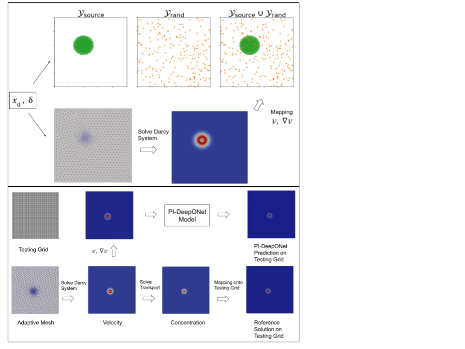

## General Description
In this repo, you will find the end-to-end implementation of our work on coupling FEM with Physics Informed DeepOnet.
Our manuscript is avaliable at [Arxiv](https://arxiv.org/abs/2508.19847). If you find this work and repository useful, 
please cite it as:

```bibtex
@misc{kara2025physicsinformeddeeponetcoupledfem,
  title   = {Physics-Informed DeepONet Coupled with FEM for Convective Transport in Porous Media with Sharp Gaussian Sources}, 
  author  = {Erdi Kara and Panos Stinis},
  year    = {2025},
  eprint  = {2508.19847},
  archivePrefix = {arXiv},
  primaryClass  = {cs.LG},
  url     = {https://arxiv.org/abs/2508.19847}
}
```

## Workflow
The general workflow is illustrated below. We first solve a Darcy-type PDE on an adaptive mesh, 
then project the resulting velocity field onto a specialized set of collocation points, 
where a Physics-Informed DeepONet is trained to learn the mapping from source terms to the 
concentration profile in the transport PDE. Refer to the actual manuscript for the full details of the 
proposed pipeline.

<p align="center">
  
</p>

Here is a general description of the codebase

`fem_deeponet.py`: driver code including all PDE and PI-DeepONet parameters. When run successfully, it creates the 
following folder structure. Major training results are written to `train_results`. To further compare FEM and PI-DeepOnet 
outcomes, you can view *vtk files in `vtk_results` in post-processing tool, e.g. Paraview. 

    ├── artifacts
    │   └── test_model
    │       ├── mesh_files
    │       ├── models
    │       ├── pde_simulation_results
    │       ├── testing_data
    │       ├── training_data
    │       ├── train_results
    │       └── vtk_results


`src`: all the source code is here. Major files are `train_data_generation.py` and `test_data_generation.py` 
governing train/test data generation. `map_from_firedrake` is responsible for all FEM-related operations while `model_file.py`
handle building/training/testing PI-DeepOnet model.

## Quick Start
 To get started, you can run the following. This should pull/run docker image and run the driver code.
```bash
chmod +x start_docker.sh
bash start_docker.sh         
python3 fem_deeponet.py      
```

## Future Plan

We plan to add tutorials on building custom PI-DeepONet frameworks for common PDE types, with FEM fully integrated. Please
feel free to reach out to me at [erdi_kara88@hotmail.com](erdi_kara88@hotmail.com) for any questions/suggestions

